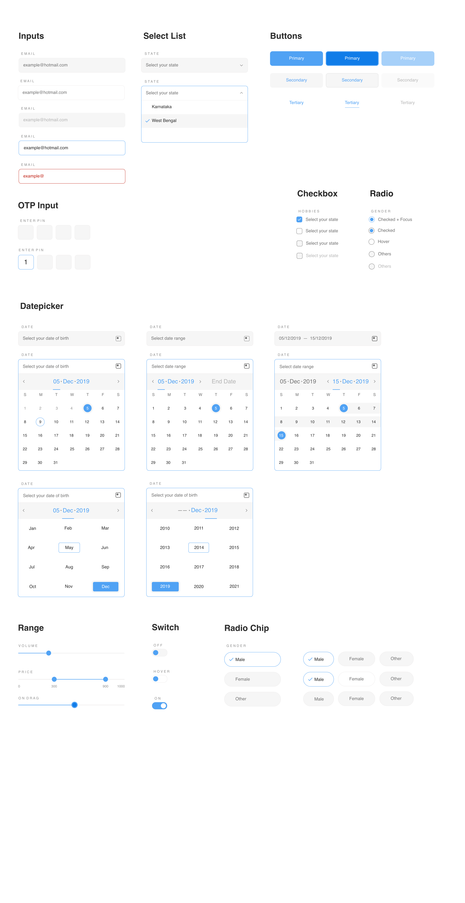

# Introduction

#### A simple minimalistic web-component set to build form elements irrespective of your choice of web framework.

This project is evolving and currently supports:

* [Button](components/button.md)
* [Text Input](components/text-input.md)
* [Select Input](components/select-input.md)
* [Checkbox](components/checkbox.md)
* [Radio](components/radio.md)
* [Date-picker](components/date-picker.md)

## Documentation

https://js-design.gitbook.io/js-design/

