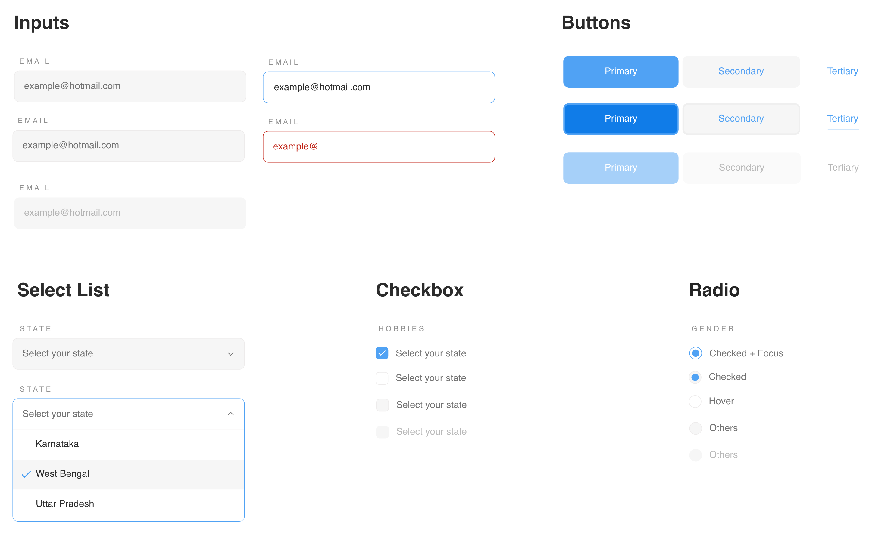

# Introduction

### A simple minimalistic web-component set to build form elements irrespective of your choice of web framework.

This project is evolving and currently supports:

* [Button](components/button.md)
* [Input](components/input.md)
* [Select](components/select.md)
* [Checkbox](components/checkbox.md)
* [Radio](components/radio.md)
* [Datepicker](components/datepicker.md)

