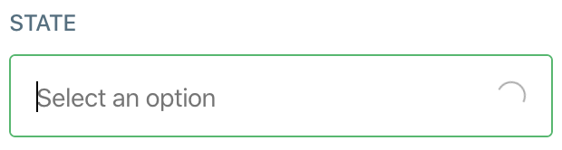
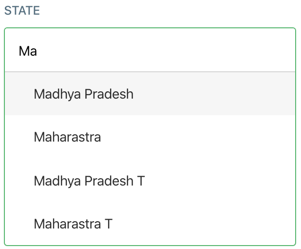
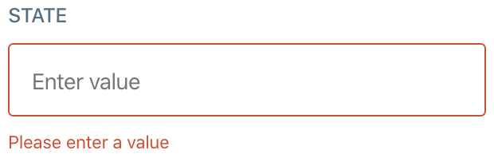
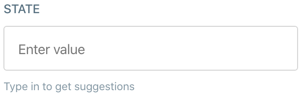
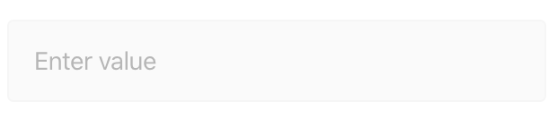

# `<jsd-autocomplete>` 

Simple autocomplete web-component to be use accross web irrespective of frameworks.

## Installation

```sh
npm install @jsdesign/autocomplete
```

## Attributes

| Name | Type | Default | Description
| ---- | ---- | ------- | -----------
| `id` | `string` | `''` | Sets the id attribute for the select. Preferred when used inside forms.
| `name` | `string` | `''` | Sets the name attribute for the select. Preferred when used inside forms.
| `label` | `string` | `''` | Label to display for the select.
| `placeholder` | `string` | `'Select an option'` | Sets the select placeholder.
| `disabled` | `string` | `'false'` | When `'true'` select is disabled cannot be interacted with.
| `autofocus` | `string` | `false` | Autofocus the select element.
| `list` | `Array` | `[]` | Creates the suggestion list based on this attribute. Should be a array of value string or object with `value` and `label`.
| `value` | `string` | `''` | Sets the default value to the input.
| `theme` | `string` | `'light` | When `'dark'`, the input will adapt to dark theme.
| `full-width` | `string` | `'false'` | When `'true'`, the  radio chip will take full width of the container.
| `error-msg` | `string` | `''` | When error message string is provided, the input will be error themed and error message is displayed.
| `help-msg` | `string` | `''` | When help message string is provided, help message is displayed.
| `loading` | `string` | `'false'` | Sets if to show loading icon on the input. Can be used if creating suggestion takes time.
| `throttle-time` | `string` | `0` | Sets the throttle time for change event. The value attribute is not affected by this and is always up to date.


## Examples

### Default Autocomplete




```html 
<jsd-autocomplete id='state' value='West Bengal' throttle-time='2000' list='["West Bengal", "Karnataka", "Uttar Pradesh", "Kerala", "Tamil Nadu", "Madhya Pradesh"]'>
</jsd-autocomplete>
```

### Autocomplete with error



```html 
<jsd-autocomplete id='state' label='STATE' error-msg='Please enter a value' list='[]'>
</jsd-autocomplete>
```

### Autocomplete with help text



```html 
<jsd-autocomplete id='state' label='STATE' help-msg='Type in to get suggestions' list='[]'>
</jsd-autocomplete>
```

### Disabled Autocomplete



```html 
<jsd-autocomplete id='state' disabled='true' list='[]'>
</jsd-autocomplete>
```

### Cutomizable property list

| Name | Default
| ---- | ---- 
|--color-primary | #1eba68;
|--color-primary-dark | #1ba75e;
|--color-secondary | #f6f6f6;
|--color-secondary-dark | #efefef;
|--color-secondary-darktheme | rgba(255, 255, 255, 0.3);
|--color-secondary-dark-darktheme | rgba(255, 255, 255, 0.6);
|--color-error | #dd4421;
|--color-error-background | #ffebe6;
|--color-placeholder | #737373;
|--color-placeholder-disabled | #e0e0e0;
|--color-placeholder-darktheme | #e0e0e0;
|--color-label | #909090;
|--color-black | #2c2c2c;
|--color-header-black | #252525;
|--color-header-tag | #747373;
|--color-white | #ffffff;
|--color-border | #edebeb;
|--border-radius | 0.5rem;
|--border-width | 1px;
|--border-width-hover | 3px;
|--label-spacing | 0.2rem;
|--label-case | uppercase;
|--label-font-size | 0.8rem;
|--button-font-weight | 500;
