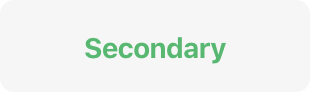
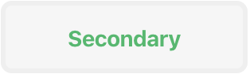
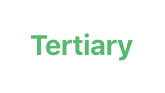
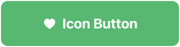
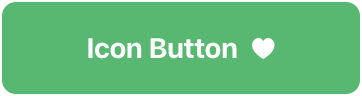
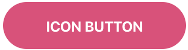

# `<jsd-button>` 

Simple button web-component to be use accross web irrespective of frameworks

## Installation

```sh
npm install @jsdesign/jsd-button
```

## Attributes

| Name | Type | Default | Description
| ---- | ---- | ------- | -----------
| `label` | `string` | `''` | Label to display for the button, and `aria-label`.
| `btn-style` | `string` | `'primary'` | Set the button style. Allowed values: `'primary'`, `'secondary'`, `'tertiary'`.
| `disabled` | `boolean` | -- | Disabled buttons cannot be interacted with and have no visual interaction effect. Allowed values: attribute is present, `false`.
| `icon` | `boolean` | -- | When attribute is present, `icon` will be displayed _before_ `label`.
| `trailing-icon` | `boolean` | -- | When attribute is present, `icon` will be displayed _after_ `label`.
| `theme` | `string` | `light` |  The button will adapt to dark theme. Allowed values: `'dark'`, `'light'`.
| `type` | `string` | `'button'` | Set the button type. Allowed values: `'button'`, `'submit'`, `'reset'`.
| `full-width` | `boolean` | -- | Makes the button take full available space. Allowed values: attribute is present, `false`.


## Examples

### Primary Button

  

```html 
<jsd-button label='Testing'></jsd-button>
<jsd-button btn-style='primary' label='Testing'></jsd-button>
```

### Secondary Button

  

```html 
<jsd-button btn-style='secondary' label='Secondary'></jsd-button>
```

### Tertiary Button

  

```html 
<jsd-button btn-style='tertiary' label='Tertiary'></jsd-button>
```

### Icon Button

  

```html 
<jsd-button icon label='Icon Button'>
    <span slot='icon'>&hearts;</span>
</jsd-button>

<jsd-button trailing-icon label='Icon Button'>
    <span slot='trailingIcon'>&hearts;</span>
</jsd-button>
```

We can pass any custom icon html in the slot elements. Also u are allowed to create css icons and can style it your way.


## Cutomization



```html
<jsd-button id="custom-button" btn-style='primary' theme='dark' label='CUSTOM BUTTON'>
</jsd-button>
```
```css
#custom-button {
    --color-primary: #e9437a;
    --border-radius: 30px;
}
```

### Cutomizable property list

| Name | Default
| ---- | ---- 
|--color-btn-style='primary' | #1eba68;
|--color-primary-dark | #1ba75e;
|--color-btn-style='secondary' | #f6f6f6;
|--color-secondary-dark | #efefef;
|--color-secondary-darktheme | rgba(255, 255, 255, 0.3);
|--color-secondary-dark-darktheme | rgba(255, 255, 255, 0.6);
|--color-error | #dd4421;
|--color-error-background | #ffebe6;
|--color-placeholder | #737373;
|--color-placeholder-disabled | #e0e0e0;
|--color-placeholder-darktheme | #e0e0e0;
|--color-label | #909090;
|--color-black | #2c2c2c;
|--color-header-black | #252525;
|--color-header-tag | #747373;
|--color-white | #ffffff;
|--color-border | #edebeb;
|--border-radius | 0.5rem;
|--border-width | 1px;
|--border-width-hover | 3px;
|--label-spacing | 0.2rem;
|--label-case | uppercase;
|--label-font-size | 0.8rem;
|--button-font-weight | 500;
