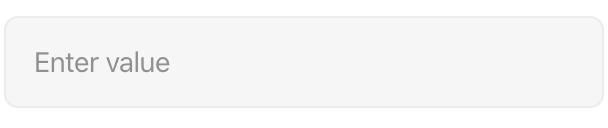
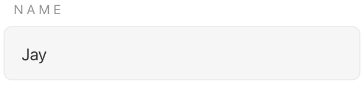
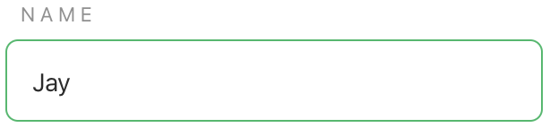
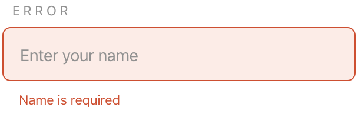
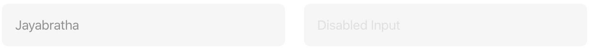
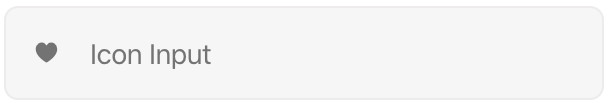
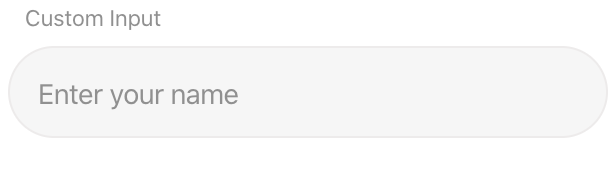

# `<jsd-input>` 

Simple input web-component to be use accross web irrespective of frameworks.

## Installation

```sh
npm install @jsdesign/jsd-input
```

## Attributes

| Name | Type | Default | Description
| ---- | ---- | ------- | -----------
| `id` | `string` | `''` | Sets the id attribute for the input. Preferred when used inside forms.
| `name` | `string` | `''` | Sets the name attribute for the input. Preferred when used inside forms.
| `type` | `string` | `'text` | Allowed input type values: `text`, `search`, `tel`, `url`, `email`, `password`, `date`, `month`, `week`, `time`, `datetime-local`, `number`, `color`
| `label` | `string` | `''` | Label to display for the input.
| `disabled` | `string` | `'false'` | When `'true'` input is disabled cannot be interacted with.
| `required` | `string` | `'false'` | When `'true'` the input field is marked mandatory.
| `value` | `string` | `''` | Sets the value property of the input. Can be used to set default value
| `placeholder` | `string` | `'Enter value'` | Sets the input placeholder.
| `autofocus` | `string` | `false` | Sets the input autofocus attribute.
| `pattern` | `string` | `''` | Sets the input attribute property for validation.
| `min` | `string` | `''` | Sets the input min attribute for number input.
| `max` | `string` | `''` | Sets the input max attribute for number input.
| `maxlength` | `string` | `''` | Sets the input maxlength attribute.
| `theme` | `string` | `'light` | When `'true'`, the input will adapt to dark theme.
| `full-width` | `string` | `'false'` | When `'true'`, the input will take full width of the container. By default the max-width is 300px.
| `error-msg` | `string` | `''` | When error message string is provided, the input will be error themed and error message is displayed.
| `help-msg` | `string` | `''` | When help message string is provided, help message is displayed.
| `icon` | `string` | `'false'` | When `'true'`, `icon` will be displayed _before_  the `placeholder`.


## Examples

### Default Input



```html 
<jsd-input></jsd-input>
```

### Input with label and value

  

```html 
<jsd-input id="name" name="name" label="name" placeholder="Enter your name" value='Jay'></jsd-input>
```

### Input with error



```html 
<jsd-input id="error" name="error" label="error" placeholder="Enter your name" error-msg='Name is required'></jsd-input>
```

### Disabled Input



```html 
<jsd-input disabled='true' type='text' value="Jayabratha" placeholder="Disabled Input"></jsd-input>

<jsd-input disabled='true' type='text' placeholder="Disabled Input"></jsd-input>
```

### Icon Input



```html
<jsd-input type='text' icon='true' placeholder="Icon Input">
    <span slot='icon' class='icon'>&hearts;</span>
</jsd-input>
```


## Cutomization



```html
<jsd-input id="custom-input" name="custom" label="Custom Input" placeholder="Enter your name"></jsd-input>
```
```css
#custom-input {
    --color-primary: #1eba68;
    --border-radius: 30px;
    --label-case: normal;
    --label-spacing: 0;
}
```

### Cutomizable property list

| Name | Default
| ---- | ---- 
|--color-primary | #1eba68;
|--color-primary-dark | #1ba75e;
|--color-secondary | #f6f6f6;
|--color-secondary-dark | #efefef;
|--color-secondary-darktheme | rgba(255, 255, 255, 0.3);
|--color-secondary-dark-darktheme | rgba(255, 255, 255, 0.6);
|--color-error | #dd4421;
|--color-error-background | #ffebe6;
|--color-placeholder | #737373;
|--color-placeholder-disabled | #e0e0e0;
|--color-placeholder-darktheme | #e0e0e0;
|--color-label | #909090;
|--color-black | #2c2c2c;
|--color-header-black | #252525;
|--color-header-tag | #747373;
|--color-white | #ffffff;
|--color-border | #edebeb;
|--border-radius | 0.5rem;
|--border-width | 1px;
|--border-width-hover | 3px;
|--label-spacing | 0.2rem;
|--label-case | uppercase;
|--label-font-size | 0.8rem;
|--button-font-weight | 500;
