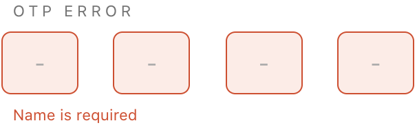

# `<jsd-pin-input>` 

Simple input web-component to be use accross web irrespective of frameworks.

## Installation

```sh
npm install @jsdesign/jsd-pin-input
```

## Attributes

| Name | Type | Default | Description
| ---- | ---- | ------- | -----------
| `id` | `string` | `''` | Sets the id attribute for the input. Preferred when used inside forms.
| `name` | `string` | `''` | Sets the name attribute for the input. Preferred when used inside forms.
| `type` | `string` | `'text` | Allowed input type values: `text`, `password`, `number`
| `label` | `string` | `''` | Label to display for the input.
| `disabled` | `string` | -- | When attribute is present, input is disabled cannot be interacted with.
| `required` | `string` | -- | When attribute is present, the input field is marked mandatory.
| `value` | `string` | `''` | Sets the value property of the input. Can be used to set default value
| `autofocus` | `string` | -- | Sets the input autofocus attribute.
| `length` | `string` | `'4'` | Sets the length pf pin.
| `theme` | `string` | `'light` | When attribute is present, the input will adapt to dark theme.
| `full-width` | `string` | -- | When attribute is present, the input will take full width of the container. By default the max-width is 300px.
| `error-msg` | `string` | `''` | When error message string is provided, the input will be error themed and error message is displayed.
| `help-msg` | `string` | `''` | When help message string is provided, help message is displayed.


## Examples

### Default Input


```html 
<jsd-pin-input></jsd-pin-input>
```

### PIN Input with label and value


```html 
<jsd-pin-input id="name" name="name" label="name"></jsd-pin-input>
```

### PIN Input with error



```html 
<jsd-pin-input id="error" name="error" label="error" error-msg='Name is required'></jsd-pin-input>
```

### Full width PIN input


```html 
<jsd-pin-input id="error" name="error" label="error" full-width error-msg='Name is required'></jsd-pin-input>
```

### Disabled PIN Input


```html 
<jsd-pin-input label='disabled' disabled type='text' value="1234"></jsd-pin-input>

<jsd-pin-input label='disabled' disabled type='text'></jsd-pin-input>
```

### Cutomizable property list

| Name | Default
| ---- | ---- 
|--color-primary | #1eba68;
|--color-primary-dark | #1ba75e;
|--color-secondary | #f6f6f6;
|--color-secondary-dark | #efefef;
|--color-secondary-darktheme | rgba(255, 255, 255, 0.3);
|--color-secondary-dark-darktheme | rgba(255, 255, 255, 0.6);
|--color-error | #dd4421;
|--color-error-background | #ffebe6;
|--color-placeholder | #737373;
|--color-placeholder-disabled | #e0e0e0;
|--color-placeholder-darktheme | #e0e0e0;
|--color-label | #909090;
|--color-black | #2c2c2c;
|--color-header-black | #252525;
|--color-header-tag | #747373;
|--color-white | #ffffff;
|--color-border | #edebeb;
|--border-radius | 0.5rem;
|--border-width | 1px;
|--border-width-hover | 3px;
|--label-spacing | 0.2rem;
|--label-case | uppercase;
|--label-font-size | 0.8rem;
|--button-font-weight | 500;
