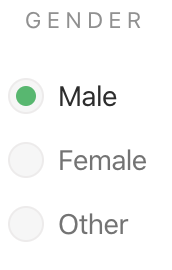
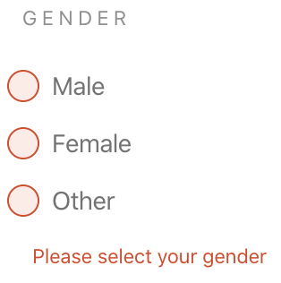
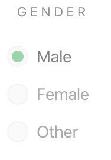

# `<jsd-radio>` 

Simple radio input web-component to be use accross web irrespective of frameworks.

## Installation

```sh
npm install @jsdesign/jsd-radio
```

## Attributes

| Name | Type | Default | Description
| ---- | ---- | ------- | -----------
| `id` | `string` | `''` | Sets the id attribute for the radio input. Preferred when used inside forms.
| `name` | `string` | `''` | Sets the name attribute for the input. Preferred when used inside forms.
| `label` | `string` | `''` | Label to display for the radio input.
| `disabled` | `boolean` | -- | When attribute is present, radio input is disabled cannot be interacted with.
| `required` | `boolean` | -- | When attribute is present, the input field is marked mandatory.
| `list` | `Array` | `[]` | Creates the radio list based on this attribute. Should be a array of value string.
| `inline` | `boolean` | -- | When attribute is present, the radio inputs will be aligned inline.
| `value` | `string` | `''` | Sets the default checked value.
| `theme` | `string` | `'light` | When `'dark'`, the input will adapt to dark theme.
| `error-msg` | `string` | `''` | When error message string is provided, the radio input will be error themed and error message is displayed.


## Examples

### Default Radio



```html 
<jsd-radio id='test' name='test' value='Male' label="gender" list='["Male", "Female", "Other"]' onchange='test(event)'></jsd-radio>
```

### Inline Radio


```html 
<jsd-radio id='gender' inline name='gender' label="gender" value='Male' list='["Male", "Female", "Other"]'></jsd-radio>
```

### Radio with error



```html 
<jsd-radio id='error' name='error' value='' error-msg="Please select your gender" label="gender" list='["Male", "Female", "Other"]'></jsd-radio>
```

### Disabled Radio



```html 
<jsd-radio id='disabled' name='disabled' disabled value='Male' label="gender" list='["Male", "Female", "Other"]'></jsd-radio>
```

### Cutomizable property list

| Name | Default
| ---- | ---- 
|--color-primary | #1eba68;
|--color-primary-dark | #1ba75e;
|--color-secondary | #f6f6f6;
|--color-secondary-dark | #efefef;
|--color-secondary-darktheme | rgba(255, 255, 255, 0.3);
|--color-secondary-dark-darktheme | rgba(255, 255, 255, 0.6);
|--color-error | #dd4421;
|--color-error-background | #ffebe6;
|--color-placeholder | #737373;
|--color-placeholder-disabled | #e0e0e0;
|--color-placeholder-darktheme | #e0e0e0;
|--color-label | #909090;
|--color-black | #2c2c2c;
|--color-header-black | #252525;
|--color-header-tag | #747373;
|--color-white | #ffffff;
|--color-border | #edebeb;
|--border-radius | 0.5rem;
|--border-width | 1px;
|--border-width-hover | 3px;
|--label-spacing | 0.2rem;
|--label-case | uppercase;
|--label-font-size | 0.8rem;
|--button-font-weight | 500;
